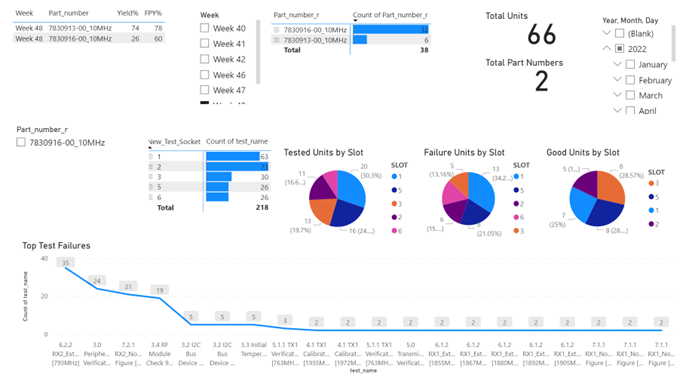

# CommScope Work Portfolio
### Analysis and Automation of tests defects using Python & Power BI for One Cell Product Line at CommScope

**Dataset:** We have around 500 .csv files coming in every week(~2000 files every month) which had data about test results for different part numbers within One Cell Product Line. Every part number undergoes several tests(~110 tests) and each file contains outcome of this tests  
&nbsp;&nbsp;&nbsp; Every file had around 150 rows of data  
&nbsp;&nbsp;&nbsp; Every year generates around 4mn rows of data
          
**Issue:** Unable to track the root causes(which part number was failing which test), data was too complex, lot of manual work (6-hours of weekly work to report visuals in Excel for 1 product line)  

**Business Questions:**  
1. What were the top 10 tests that failed for current year? Was it the same for previous year?  
2. If we develop an automated system for this product line, can we implement then for other product lines?  
 
 -----
 
_Possible solutions that I tried for this problem:_

**1. Excel:** We can run a VBA code to merge all these files and create a single .csv file and later push this file to a visualization tool (ex. PowerBi)
&nbsp;&nbsp; _Disadvantage:_ Excel has a limitation of ~1mn rows, so it will be difficult to work with files that generate more than a million rows every month.
&nbsp;&nbsp; Also, for data transformation and cleaning for every file using VBA, the computational time was really high to go through every file and make the changes. 
 
**2. Alteryx**: Alteryx was an excellent solution to this problem, but  
&nbsp;&nbsp; a. It has limited functionalities with a free version   
&nbsp;&nbsp; b. It is expensive. We might have to buy licenses for all the users. We were planning to implement a similar automation system to different product lines within our Business unit, so getting permits for everyone would have cost our Business much money.

**3. Python**: Python is a free, open-source programming language. It has rich libraries which exactly suit our business needs. The code is readable. It can be easily implemented to other product lines within CommScope with just a bit of change within code. Data cleaning, and processing is very fast with Python. (It takes me seconds to run the complete models and to push the file to my visualization tool: Power Bi)

-----

**My Contribution:**

1. I was able to automate this entire process using Python.  As a result, I saved 6 hours of weekly work along with being able to find out the root cause analysis.

**Current workflow**

 

**Impact of this project:**

----

1. I could identify specific failures with the help of these dashboards and the results were further provided to the engineering team at the plant location. As a result, once the changes were made, we monitored the results for the next month, and we found out that the improvement in the yields were more than 90% and the repeat testing was reduced by 45%, which was a major breakthrough for us since we have a product line in its testing/pilot phase.  
2. Saved 6 hours of manual work weekly. This same approach is used for another product line which additionally saved 6 hrs of manual work weekly. Total time saved = **12hrs**
                    
**People who will be using this dashboard:**  
 Senior Engineer, 
 Principal Engineer- Test development, 
 Quality Manager, 
 Principal Manufacturing Engineer, 
 Director- Quality, 
 NPI Product Engineer. 
 
**Dashboard:** Sample dates(November 2022) 

-----

 
 

-----

