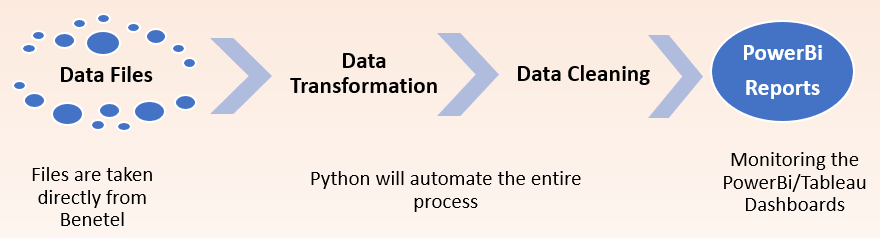
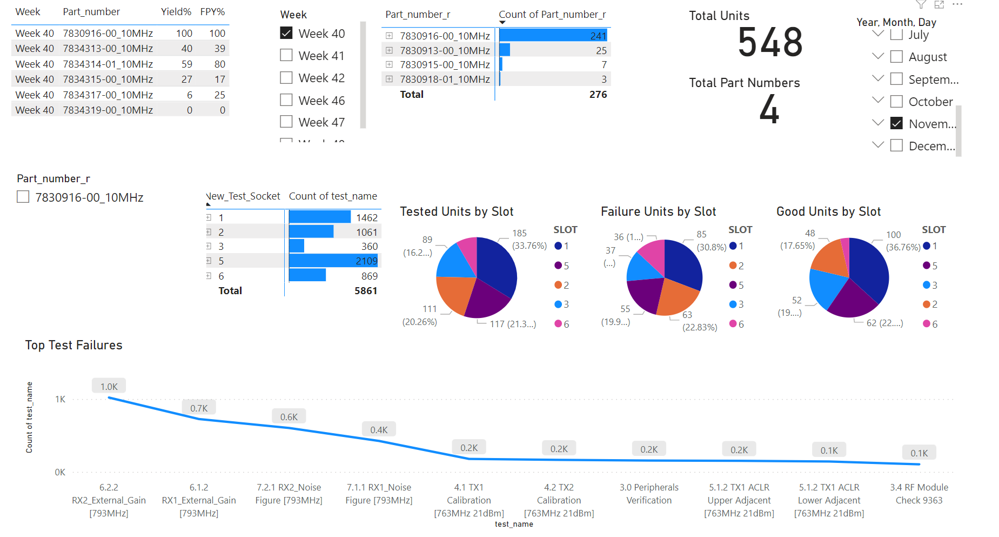

# CommScope Work Portfolio
Analysis and Automation of tests defects using Python & Power Bi for One Cell product line at CommScope

**Dataset:** We have around 500 .csv files coming in every week(~2000 files every month) showing test reaults for varied tests for the part number for One Cell product Line
          Every file had around 150 lines of output (Results of every test done for that part number)
          
**Issue:** Unable to track the root causes(which part number was failing which test), data was too complex, lot of manual work (6 hour analysis every week to report visuals in Excel)
 
_Possible solutions that I tried for this problem:_

**1. Excel:** We can run a VBA code to merge all these files together and create a single .csv file and later push this file to a visualizatio tool (ex. PowerBi)
          Disadvantage: Excel has a limitation of ~1mn rows, it will difficult to work with files that generates more than a million rows every month. Also, for data                             transformation and cleaning for every file using VBA, the computational time was be really high to go through every file and make the changes. 
 
**2. Alteryx**: Alteryx was a good solution to this problem, but 
             a. It has limited functionalities with free version 
             b. It is expensive. We might have to buy licenses to all the users and we were planning to implement a similar automation system to different product lines                 within our Business unit, so getting licenses for everyone would have cost out BU a lot of money.

**3. Python**: Python is free, open source programming language. It has rich libraries which exactly suited our bussiness need. The code is readable. Can be easily implemented to other product lines within CommScope with just a bit of changes within code. Data cleaning, processing is very fast with Python. (It takes me seconds to run the complete models and to push the file to my visualization tool: Power Bi)

**My Contribution:**
1. I was able to automate this entire process using Python. As a result I was able to save 6 hours of weekly work along with able to find out root cause analysis.
Current work flow

**Impact of this project:** I was able to identify specific failures with the help of these dashbaords and tbe results were further provided to the enginnering team at plant location. As a result, once the changes were made, we monitored the results for the next month and we found out that the improvement in the yields were more than 90% and the repeat testing was reduced by 45% which was a major breakthrough for us since we have a product line in it's testing/pilot phase.
                    This dashboard is now used by the senior engineer to show the results for every weekly meetings.
                    
 People who will be using this dashboard:
 Senior Engineer,
 Principal Engineer- Test development,
 Quality Manager,
 Principal Manufacturing Engineer,
 Director- Quality,
 NPI Product Engineer.

**Dashboard:**

 

